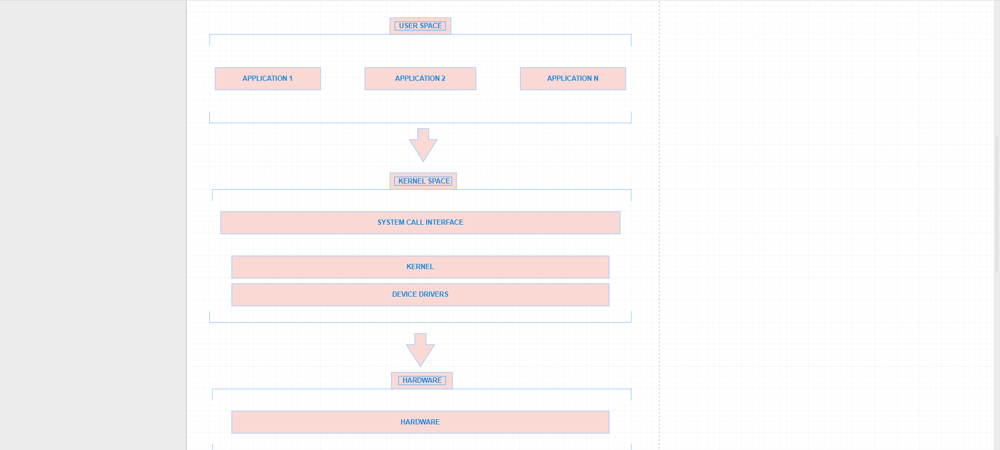

# Laporan Praktikum Minggu 1
Topik: Arsitektur Dasar Operasi Sistem dan Kernel

---

## Identitas
- **Nama**  : Alya Deviana Putri Reynaldi
- **NIM**   : 250202928
- **Kelas** : 1IKRB

---

## Tujuan
Tuliskan tujuan praktikum minggu ini.
> Mengetahui dan memahami komponen utama serta peran pada sistem operasi.

> Bisa membandingkan beberapa model sistem operasi berdasarkan kelebihan dan kekurangan.

> Melatih kemampuan analisis terhadap desain arsitektur operasi sistem dan bisa menggambarkan diagram arsitektur sistem operasi menggunakan alat bantu digital.

---

## Dasar Teori
1. Sistem Operasi

   Sistem Operasi adalah perangkat lunak utama yang mengelola sumber daya perangkat keras dan perangkat lunak pada komputer serta mengontrol perangkat seperti prosesor.
   
2. Komponen Utama Sistem Operasi

   Sistem Operasi terdiri dari beberapa koponen utama seperti kernel yang merupakan inti sistem operasi yang mengontrol semua aktivitas sistem dan system call menjadi jembatan antar program aplikasi dan kernel.
   
3. Jenis Sistem Operasi

   Sistem operasi memiliki beberapa jenis, antara lain batch, time sharing, real time, yang masing-masing dirancang sesuai cara kerjanya.

   
4. Model Arsitektur Sistem Operasi
   Arsitektur sistem operasi dapat dibedakan menjadi beberapa model seperti monolithic, layered, dan microkernel, perbedaan ketiganya terletak pada cara komponen sistem operasi saling berinteraksi.


---

## Langkah Praktikum
1. Langkah-langkah yang dilakukan.  
2. Perintah yang dijalankan.  
3. File dan kode yang dibuat.  
4. Commit message yang digunakan.

---

## Kode / Perintah
Tuliskan potongan kode atau perintah utama:
```bash
uname -a
lsmod | head
dmesg | head
```

---

## Hasil Eksekusi
Sertakan screenshot hasil percobaan atau diagram:


---

## Analisis
- Jelaskan makna hasil percobaan.
  
  . Untuk uname -a menampilkan identifikasi informasi lengkap tentang sistem operasi dan kernel.
  . untuk lsmod | head menampilkan modul kernel yang sedang aktif dimuat di kernel.
  . untuk dmesg | head menampilkan pesan sistem dari kernel dan mendeteksi error hardware 
- Hubungkan hasil dengan teori (fungsi kernel, system call, arsitektur OS).
  
Dari hasil perintah "uname -a" menunjukkan bahwa kernel berperan sebagai inti sistem operasi yang berfungsi mengelola sumber daya perangkat keras dan juga menjadi penghubung antara perangkat keras dengan lunak.

untuk perintah "dmesg | head" sistem memanggil system call untuk membaca pesan log kernel ini membuktikan adanya lapisan komunikasi antara user space dan kernel space karena system call berfungsi sebagai jembatan antara program pengguna dengan fungsi-fungsi kernel, contohnya adalah membaca file log.

  Hasil percobaan untuk os bekerja secara berlapis, perintah dari pengguna diproses melalui system call menuju kernel untuk mengatur sumber daya dan kembali lagi ke user space.


- Apa perbedaan hasil di lingkungan OS berbeda (Linux vs Windows)?

 Pada Linux, perintah seperti uname -a, lsmod, dan dmesg bisa langsung menampilkan informasi detail tentang kernel, modul, serta proses booting karena Linux bersifat open source dan berbasis kernel monolitik yang memberi akses lebih langsung ke lapisan kernel. Sementara itu, di Windows perintah tersebut hanya bisa diakses lewat system Information atau Event Viewer, hasil di windows lebih terbatas.

---

## Kesimpulan
Tuliskan 2–3 poin kesimpulan dari praktikum ini.

Dari praktikum ini dapat disimpulkan bahwa sistem operasi berfungsi mengelola dan mengoordinasikan sumber daya komputer, seperti prosesor, memori, dan perangkat I/O, agar seluruh proses dapat berjalan dengan efisien.

Melalui perintah uname -a, lsmod, dan dmesg, dapat diketahui bahwa kernel merupakan inti dari sistem operasi yang menangani identifikasi sistem, pengelolaan modul kernel, serta pencatatan pesan sistem selama proses booting dan operasi berjalan.

Hasil percobaan menunjukkan bahwa komunikasi antara user space dan kernel space terjadi melalui system call, yang menjadi jembatan bagi program pengguna untuk berinteraksi dengan fungsi-fungsi penting di dalam kernel tanpa mengakses perangkat keras secara langsung.

---

## Quiz
1. Sebutkan tiga fungsi utama sistem operasi.
 
   **Jawaban:**

   1. Manajemen Proses
      
      Mengatur eksekusi program dan proses agar berjalan seacara efisien.
   2. Manajemen Memori
      
      Mengalokasikan dan memantau penggunaan RAM serta memori virtual.
      
   3. Manajemen Perangkat
      
      Mengontrol perangkat input/output seperti keyboard, mouse, printer dan jaringan.
      
2. Jelaskan perbedaan antara kernel mode dan user mode.
   
   **Jawaban:**

   Kernel mode adalah mode eksekusi dalam sistem operasi yang memiliki hak akses tertinggi, memungkinkan sistem untuk berinteraksi langsung dengan seluruh sumber daya perangkat keras seperti prosesor, memori, dan perangkat I/O, serta menjalankan fungsi-fungsi inti seperti manajemen memori, penjadwalan proses, dan pengendalian perangkat; sedangkan user mode adalah mode dengan hak akses terbatas yang digunakan oleh program aplikasi agar tetap terisolasi dari sistem inti, sehingga jika terjadi kesalahan pada aplikasi, tidak akan mempengaruhi kestabilan atau keamanan sistem operasi secara keseluruhan.
   
3. Sebutkan contoh OS dengan arsitektur monolithic dan microkernel
   
   **Jawaban:**

    Contoh OS arsitektur monolithic adalah MS-DOS, UNIX, Linux
   
    Contoh OS arsitektur microkernel  adalah Mach, QNX, Minix, L4 MIcrokernel Familu

--

## Ringkasan

Perbedaan Monolithic Kernel, Microkernel, dan Layered Architecture serta Contoh OS Nyata Masing-Masing Model Kernel.

1.	Monolithic Kernel
   
Model arsitektur fungsionalitas kernel, termasuk manajemen proses, sistem file, driver perangkat, dan protokol jaringan, diimplementasikan sebagai satu blok kode besar dalam kernel space. Kelebihan dari Monolithic Kernel adalah performa tinggi antar-komponen cepat, sedangkan kekurangannya adalah sulit untuk debugging dan kurang aman karena semua kode memiliki akses penuh ke hardware.

 
 Contoh OS nyata dari model kernel Monolithic Kernel :
 
•	Linux Kernel 

Inti dari sistem operasi Linux yang berfungsi menghubungkan hardware dengan software.

•	FreeBSD

Sistem operasi bebas dan open-source yang berasal dari sistem UNIX yang dirancang untuk kinerja tinggi, stabilitas, keamanan, dan kompatibilitas jaringan.

•	Windows NT Kernel

Inti dari sistem operasi Windows modern yang bertugas mengatur semua interaksi antara hardware dan software.

2.	Microkernel
   
Model arsitektur kernel sistem operasi yang hanya memuat komponen inti paling dasar ke dalam kernel, sementara fungsi-fungsi lainnya dijalankan di luar kernel sebagai layanan terpisah atau user space. Kelebihan dari Microkernel adalah sangat fleksibel dan lebih aman karena server tetap stabil, sedangkan kekurangannya adalah overhead performa dan kompleksitas desain yang tinggi.

Contoh OS nyata dari model kernel Microkernel :

•	Minix

Sistem operasi berbasis UNIX yang dibuat untuk tujuan pendidikan dan digunakan sebagai inspirasi untuk Linux awal versi modern (Minix 3) yang fokus pada keamanan dan reliabilitas seperti di perangkat IoT.

•	QNX

digunakan di otomotif, medis, dan embedded systems. Kernelnya sangat minimal, dengan IPC untuk komunikasi dikenal karena stabilitasnya di lingkungan kritis.

•	seL4 (L4 Microkernel Family)

Kernel mikro open-source yang diverifikasi secara formal untuk keamanan yang digunakan di sistem militer, aerospace dan prototipe seperti OKL4 di perangkat mobile.

3.	Layered Architecture
   
Model arsitektur sistem operasi atau perangkat lunak yang membagi sistem menjadi beberapa lapisan yang tersusun secara hierarkis. Kelebihan dari Layered Architecture adalah mudah untuk memahami dan maintain karena pemisahan tanggung jawab sedangkan kekurangannya adalah kurang fleksibel untuk perubahan horizontal.

Contoh OS nyata dari model kernel Layered Architecture :

•	THE Multiprogramming System

Sistem operasi eksperimental yang membagi sistem menjadi beberapa lapisan, di mana setiap lapisan hanya berinteraksi dengan lapisan di atas atau di bawahnya.

•	Multics

Sistem operasi yang dikembangkan untuk mendukung penggunaan komputer oleh banyak pengguna secara bersamaan.

•	IBM OS/360

Sistem operasi mainframe yang dikembangkan Sistem ini dirancang untuk menjadi sistem operasi universal yang digunakan di berbagai jenis komputer dalam keluarga System/360, mulai dari yang kecil hingga besar.

Analisis Relevan Model Kernel untuk Sistem Modern.

Monolithic kernel menjadi pilihan utama dan paling relevan di era digital kini, terutama karena kemampuannya handle beban kerja yang baik dan juga bisa menyeimbangkan kecepatan, skalabilitas, maupun adaptasi. Berikut ini adalah penjelasan mengenai alasan monolithic kernel menjadi paling relevan.

•	Efisiensi Performa Tinggi

Semua komponen berjalan baik di dalam kernel space, minim overhead dan sangat baik untuk cloud computing.

•	Skalabilitas untuk Hardware Modern

Sangat mendukung untuk multi-core dan monolithic membantu proses dengan cepat tensor karena akses hardwarenya yang langsung ke GPU/TPU.

•	Adaptasi Fleksibel

 Fitur seperti Loadable bisa menambah atau menghapus driver runtime tanpa reboot. Ditambah, fitur containers bisa mengatasi kelemahan keamanan tanpa ganti arsitektur.
 
•	Biaya Rendah & Open-Source

 Gratis dan customizable, ideal untuk startup AI atau perusahaan.


## Refleksi Diri
Tuliskan secara singkat:
- Apa bagian yang paling menantang minggu ini?

  Bagian yang paling menantang minggu ini adalah ketika saya kurang teliti saat mengerjakan langkah-langkah praktikum, sehingga harus mengulang pekerjaan dua kali untuk mendapatkan hasil yang benar.
- Bagaimana cara Anda mengatasinya?

   Cara saya mengatasinya adalah dengan lebih berhati-hati dan memastikan setiap langkah sudah benar sebelum dijalankan, serta menyimpan file hasil pekerjaan secara berkala agar tidak kehilangan data dan bisa diperbaiki dengan mudah jika terjadi kesalahan.

---

**Credit:**  
_Template laporan praktikum Sistem Operasi (SO-202501) – Universitas Putra Bangsa_
