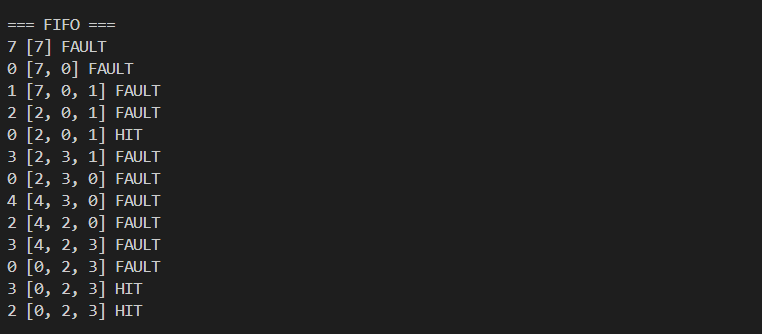
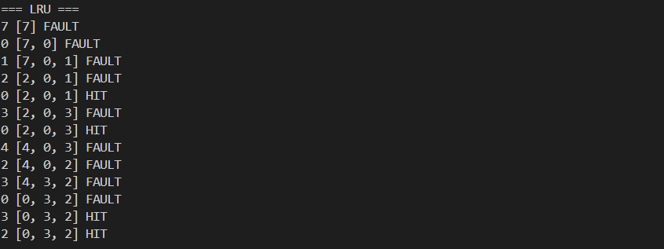
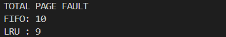

# Laporan Praktikum Minggu 10
Topik: Manajemen Memori – Page Replacement (FIFO & LRU)

---

## Identitas
- **Nama**  : Alya Deviana Putri Reynaldi
- **NIM**   : 250202928
- **Kelas** : 1IKRB

---

## Tujuan
1. Menguasai fondasi memori virtual beserta isu page fault dalam sistem operasi

2. Merealisasikan simulasi algoritma FIFO dan LRU dengan bahasa pemrograman yang dipilih

3. Mengevaluasi output simulasi untuk menghitung jumlah page fault yang muncul

4. Membandingkan kinerja algoritma FIFO dan LRU sesuai hasil uji coba

---

## Dasar Teori
1. Memori virtual memungkinkan eksekusi program lebih besar dari RAM fisik dengan membagi memori menjadi page yang dimuat dari storage sekunder ke memori utama saat dibutuhkan.

2. Page fault muncul ketika page proses tidak ada di RAM, sehingga OS harus memuatnya dari disk dan menerapkan algoritma penggantian jika memori penuh.

3. Algoritma FIFO (First-In First-Out) mengganti page tertua yang pertama masuk ke memori menggunakan struktur queue, meski sederhana tapi mengabaikan pola akses halaman.

4. Algoritma LRU (Least Recently Used) menyingkirkan page paling lama tak dipakai dengan asumsi pola akses masa lalu, menghasilkan page fault lebih rendah tapi implementasinya lebih rumit daripada FIFO.

5. Page hit terjadi jika page sudah ada di memori, sedangkan page fault memerlukan pemuatan dari disk, dan efektivitas algoritma diukur dari jumlah page fault minimal.


---

## Langkah Praktikum
1. Memilih bahasa pemrograman Python
2. Menyiapkan reference string dan frame memori
3. Membuat simulasi page replacement FIFO
4. Mengimplementasikan logika antrian FIFO
5. Menghitung page fault untuk algoritma FIFO
6. Membuat simulasi page replacement LRU
7. Mengimplementasikan pelacakan penggunaan LRU
8. Menghitung page fault untuk algoritma LRU
9. Menjalankan dan membandingkan kedua simulasi
10. Menganalisis hasil serta menyusun laporan


---

## Kode / Perintah

- Bahasa pemrograman **bebas** (Python / C / Java / lainnya).
- Program berbasis **terminal** (tidak wajib GUI).


 ```
praktikum/week10-page-replacement/
├─ code/
│  ├─ page_replacement.*
│  └─ reference_string.txt
├─ screenshots/
│  └─ hasil_simulasi.png
└─ laporan.md
```


---


1. **Menyiapkan Dataset**

   Gunakan *reference string* berikut sebagai contoh:
   ```
   7, 0, 1, 2, 0, 3, 0, 4, 2, 3, 0, 3, 2
   ```
   Jumlah frame memori: **3 frame**.

2. **Implementasi FIFO**

   - Simulasikan penggantian halaman menggunakan algoritma FIFO.
   - Catat setiap *page hit* dan *page fault*.
   - Hitung total *page fault*.

3. **Implementasi LRU**

   - Simulasikan penggantian halaman menggunakan algoritma LRU.
   - Catat setiap *page hit* dan *page fault*.
   - Hitung total *page fault*.

4. **Eksekusi & Validasi**

   - Jalankan program untuk FIFO dan LRU.
   - Pastikan hasil simulasi logis dan konsisten.
   - Simpan screenshot hasil eksekusi.

5. **Analisis Perbandingan**

   Buat tabel perbandingan seperti berikut:

   | Algoritma | Jumlah Page Fault | Keterangan |
   |:--|:--:|:--|
   | FIFO | ... | ... |
   | LRU | ... | ... |


---

## Hasil Eksekusi
Sertakan screenshot hasil percobaan atau diagram:


---

## Analisis

Referensi String dengan frame memori 3

7, 0, 1, 2, 0, 3, 0, 4, 2, 3, 0, 3, 2


1. FIFO
   


2. LRU
   


3. TOTAL PAGE FAULT
   



ANALISIS PERBANDINGAN 

| Algoritma | Jumlah Page Fault | Deskripsi                                                                                        |
| --------- | ------------------------ | ------------------------------------------------------------------------------------------------ |
| FIFO      | 10                       | Melakukan penggantian halaman berdasarkan susunan kedatangan awal, mengabaikan tingkat pemakaian |
| LRU       | 9                        | Melakukan penggantian halaman yang paling lama tidak dipakai                                     |

Penjelasan Perbedaan.

Perbedaan jumlah page fault muncul karena algoritma FIFO hanya melihat urutan masuk halaman ke memori. Akibatnya, halaman yang masih sering digunakan bisa terganti meski masih dibutuhkan.

Sebaliknya, algoritma LRU memperhatikan sejarah pemakaian halaman. Halaman yang jarang dipakai atau lama tak digunakan akan diganti duluan, sehingga mengurangi kemungkinan page fault.


Keefisienan.

Berdasarkan hasil simulasi, algoritma LRU lebih unggul daripada FIFO sebab menimbulkan jumlah kesalahan halaman yang lebih rendah. Dengan memanfaatkan data penggunaan terakhir halaman, LRU dapat menjaga halaman yang masih diperlukan tetap berada di memori, sehingga performa sistem semakin baik.

---

## Kesimpulan

1. Simulasi algoritma penggantian halaman FIFO dan LRU telah dilaksanakan sukses dengan reference string dan 3 frame memori, serta berhasil merekam setiap page hit serta page fault lewat tampilan terminal.

2. Hasil simulasi mengindikasikan algoritma FIFO mencatat 10 page fault, sementara LRU hanya 9 page fault, yang membuktikan perbedaan tingkat keefektifan keduanya.

3. Berdasarkan analisis perbandingan, algoritma LRU lebih optimal ketimbang FIFO karena memperhitungkan sejarah pemakaian halaman, sehingga menurunkan jumlah page fault dan menyempurnakan performa pengelolaan memori.


---

## Quiz
1. Apa perbedaan utama FIFO dan LRU?
   
   **Jawaban:**

   FIFO (First In First Out) mengganti halaman yang paling lama berada di memori, tanpa memedulikan kapan halaman itu terakhir kali digunakan. Sementara itu, LRU (Least Recently Used) menargetkan halaman yang paling lama tidak diakses, dengan mempertimbangkan waktu akses terakhirnya, sehingga lebih mengutamakan halaman yang baru saja dipakai.


   
2. Mengapa FIFO dapat menghasilkan Belady’s Anomaly?
   
   **Jawaban:**
   
   FIFO bisa menimbulkan Belady's Anomaly karena algoritma ini mengabaikan pola akses ke depan maupun riwayat penggunaan halaman. Saat jumlah frame memori bertambah, halaman yang sudah lama masuk mungkin tetap disimpan meski tak lagi dibutuhkan, sehingga page faults justru meningkat secara tak terduga seperti kasus di mana frame lebih banyak malah menurunkan performa.
   
3. Mengapa LRU umumnya menghasilkan performa lebih baik dibanding FIFO?
  
   **Jawaban:**
   
LRU biasanya lebih unggul karena memanfaatkan riwayat akses halaman untuk mengganti yang paling lama tak digunakan atau lebih tepatnya memprediksi halaman yang tak lagi dibutuhkan. Akibatnya, page faults berkurang dibanding FIFO, yang hanya mengandalkan urutan masuk dan berisiko mengusir halaman masih relevan, khususnya pada pola akses berulang atau lokalitas temporal. LRU pun terhindar dari anomali Belady dan terbukti lebih efisien di skenario nyata.


---

## Refleksi Diri
Tuliskan secara singkat:
- Apa bagian yang paling menantang minggu ini?

 **Jawaban:**

 Memahami LRU pada simulasi CPU scheduling terutama dalam menangani stack distance untuk prediksi akses halaman secara efisien.
  
- Bagaimana cara Anda mengatasinya?  

 **Jawaban:**

 Mencoba mempelajari dan mencermati.


---

**Credit:**  
_Template laporan praktikum Sistem Operasi (SO-202501) – Universitas Putra Bangsa_
