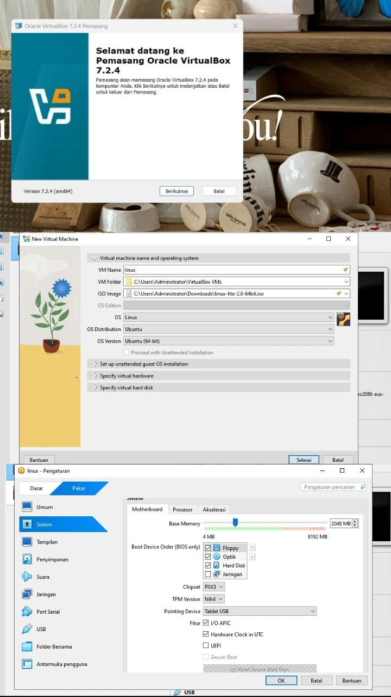
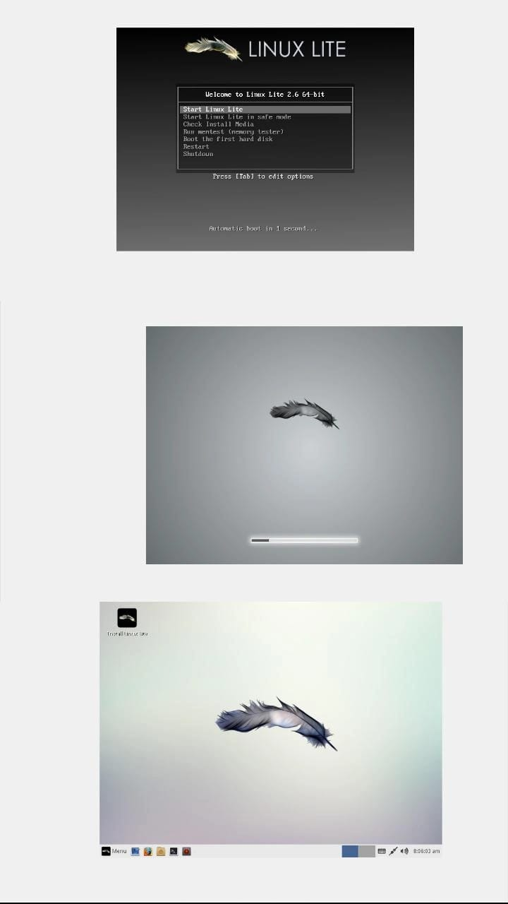
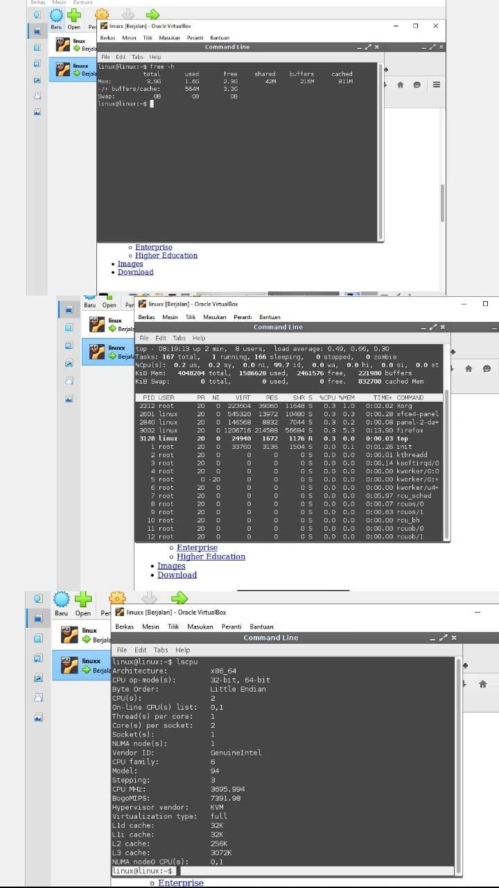

# Laporan Praktikum Minggu 12
Topik: Virtualisasi Menggunakan Virtual Machine

---

## Identitas
- **Nama**  : Alya Deviana Putri Reynaldi
- **NIM**   : 250202928 
- **Kelas** : 1IKRB

---

## Tujuan
1. Memahami konsep virtualisasi sistem operasi serta manfaat penggunaannya dalam lingkungan komputasi.

2. Mengoperasikan perangkat lunak virtualisasi untuk membuat dan menjalankan mesin virtual.

3. Melakukan instalasi sistem operasi guest pada mesin virtual hingga berfungsi dengan baik.

4. Mengatur dan menyesuaikan alokasi sumber daya mesin virtual sesuai kebutuhan sistem.

5. Menganalisis mekanisme isolasi dan keamanan sistem operasi melalui penggunaan virtual machine.

---

## Dasar Teori
1. Virtualisasi

   Virtualisasi adalah teknologi yang memungkinkan satu komputer fisik menjalankan beberapa sistem operasi secara bersamaan dengan cara memisahkan lingkungan kerja masing-masing sistem secara virtual.

2. Perbedaaan Host OS dan Guest OS

   Host OS adalah sistem operasi utama yang berjalan langsung di atas perangkat keras, sedangkan Guest OS adalah sistem operasi yang dijalankan di dalam mesin virtual di atas host OS.

3. Hypervisor

   Hypervisor adalah lapisan perangkat lunak yang bertugas mengelola mesin virtual, mengalokasikan sumber daya perangkat keras, serta memastikan isolasi antara host dan guest OS.

4. Kinerja dan Overhead Virtualisasi

   Penggunaan virtual machine menimbulkan overhead karena adanya lapisan tambahan antara hardware dan sistem operasi, namun overhead ini dapat diminimalkan dengan konfigurasi resource yang tepat.

5. Keamanan Melalui Lingkungan Terisolasi

   Virtualisasi menciptakan batasan antar sistem yang berjalan, sehingga aktivitas atau kesalahan pada satu mesin virtual tidak langsung berdampak pada sistem lainnya.


---

## Langkah Praktikum
1. Menyiapkan perangkat utama dengan memverifikasi sistem operasi host tobat normal dan aktivasi fitur virtualisasi CPU.

2. Memasang aplikasi virtualisasi di sistem host hingga dapat beroperasi dengan lancar.

3. Membuat VM baru dan memilih tipe sistem operasi untuk guest OS.

4. Mengatur spesifikasi dasar VM termasuk jumlah core CPU, ukuran RAM, dan kapasitas disk virtual.

5. Menjalankan VM menggunakan ISO instalasi sistem operasi guest.

6. Menyelesaikan seluruh proses instalasi guest OS hingga tuntas.

7. Memastikan guest OS berhasil boot ke desktop dan berfungsi normal.

8. Menyesuaikan alokasi sumber daya VM seperti core prosesor dan memori.

9. Menganalisis perubahan performa VM pasca-penyesuaian konfigurasi.

10. Mendokumentasikan hasil observasi beserta screenshot setiap tahapan krusial praktikum.

---

## Kode / Perintah

 **Ketentuan Teknis**
 
- Virtualisasi dapat menggunakan **VirtualBox** atau **VMware**.  
- Sistem operasi guest bebas (Linux Ubuntu direkomendasikan).  
- Praktikum dapat dilakukan secara **kelompok kecil (2–3 orang)**.

Struktur folder (sesuaikan dengan template repo):
```
praktikum/week12-virtual-machine/
├─ code/
│  └─ catatan_konfigurasi.txt (opsional)
├─ screenshots/
│  ├─ instalasi_vm.png
│  ├─ konfigurasi_resource.png
│  └─ os_guest_running.png
└─ laporan.md
```

---

**Langkah**

1. **Instalasi Virtual Machine**
   - Instal VirtualBox atau VMware pada komputer host.  
   - Pastikan fitur virtualisasi (VT-x / AMD-V) aktif di BIOS.

2. **Pembuatan OS Guest**
   - Buat VM baru dan pilih OS guest (misal: Ubuntu Linux).  
   - Atur resource awal:
     - CPU: 1–2 core  
     - RAM: 2–4 GB  
     - Storage: ≥ 20 GB

3. **Instalasi Sistem Operasi**
   - Jalankan proses instalasi OS guest sampai selesai.  
   - Pastikan OS guest dapat login dan berjalan normal.

4. **Konfigurasi Resource**
   - Ubah konfigurasi CPU dan RAM.  
   - Amati perbedaan performa sebelum dan sesudah perubahan resource.

5. **Analisis Proteksi OS**
   - Jelaskan bagaimana VM menyediakan isolasi antara host dan guest.  
   - Kaitkan dengan konsep *sandboxing* dan *hardening* OS.

6. **Dokumentasi**
   - Ambil screenshot setiap tahap penting.  
   - Simpan di folder `screenshots/`.


---

## Analisis



**1. Proses Instalasi**

   Instalasi dan konfigurasi sistem operasi Linux menggunakan Oracle VirtualBox versi 7.2.4 sebagai software virtualisasi. Proses dimulai dengan instalasi VirtualBox pada sistem operasi host, kemudian dilanjutkan dengan pembuatan Virtual Machine baru bernama "linux" dengan sistem operasi Linux (Ubuntu 64-bit) menggunakan file ISO Linux Lite sebagai media instalasi.



**2.  Proses Booting Virtual Machine**

   Setelah konfigurasi Virtual Machine selesai, dilakukan proses booting Linux Lite yang dimulai dengan pemuatan kernel dan layanan dasar sistem. Sistem kemudian melanjutkan proses loading environment desktop hingga siap digunakan, yang menandakan sistem berjalan dengan normal. Akhirnya, Linux Lite berhasil menampilkan desktop secara penuh, yang mengindikasikan bahwa instalasi dan konfigurasi sistem operasi telah berhasil dilakukan dengan baik.

   

   

   
**3. Percobaan dan Pengujian Sebelum Perubahan Resource**

   Setelah instalasi selesai, dilakukan serangkaian pengujian untuk memastikan sistem berjalan dengan baik. Pengujian akses internet dilakukan dengan membuka website Google dan Instagram melalui browser Firefox yang menunjukkan koneksi jaringan Virtual Machine berfungsi normal. Selanjutnya dilakukan pengecekan spesifikasi sistem menggunakan beberapa perintah Linux, yaitu perintah `lscpu` untuk menampilkan informasi CPU seperti arsitektur, jumlah core, dan jenis virtualisasi, perintah `free -h` untuk melihat penggunaan memori RAM termasuk total memori, memori terpakai, dan memori yang tersedia, serta perintah `top` untuk monitoring penggunaan CPU dan memori secara real-time yang menunjukkan sistem berjalan normal dengan beban CPU yang relatif rendah.

   
   


**4. Perubahan dan Pengujian Resource Virtual Machine**

   Untuk meningkatkan performa sistem, dilakukan perubahan resource Virtual Machine melalui Oracle VirtualBox dari konfigurasi awal RAM 2048 MB (2 GB) dan 1 CPU core menjadi Base Memory (RAM) 4096 MB (4 GB) dan jumlah CPU 2 core. Setelah perubahan diterapkan, dilakukan verifikasi menggunakan beberapa perintah Linux untuk memastikan konfigurasi baru berhasil diterapkan. Perintah `lscpu` menunjukkan bahwa sistem telah mengenali 2 CPU dengan arsitektur x86_64 (64-bit) dan menggunakan virtualisasi penuh dengan vendor CPU GenuineIntel. Perintah `free -h` memverifikasi bahwa total memori sekitar 3.9 GB telah tersedia dengan masih banyak memori bebas yang tersisa. Monitoring menggunakan perintah `top` menunjukkan bahwa sistem berjalan stabil dengan beban CPU yang relatif rendah dan tidak ada proses yang menggunakan resource secara berlebihan, mengindikasikan bahwa peningkatan resource berhasil meningkatkan performa sistem tanpa menimbulkan bottleneck atau overload.


   

   **Analisis Proteksi OS**

**Isolasi antara Sistem Host dan Guest pada Virtual Machine:**

Virtual Machine menciptakan pemisahan yang jelas antara sistem operasi utama (host) dan sistem operasi yang berjalan di dalamnya (guest). Pemisahan ini dimungkinkan oleh hypervisor seperti VirtualBox yang berperan sebagai pengatur dan pembatas akses. Guest OS tidak bisa langsung mengakses perangkat keras atau data yang ada di host karena semua aksesnya dikelola melalui lapisan virtualisasi. Setiap mesin virtual mendapatkan alokasi sumber daya tersendiri seperti prosesor, memori, dan penyimpanan yang bersifat independen. Hal ini membuat aktivitas atau bahkan gangguan keamanan yang terjadi di dalam guest tidak akan berdampak pada sistem host maupun virtual machine lainnya.

**Hubungan dengan Konsep Sandboxing dan Hardening OS:**

Mekanisme isolasi pada VM memiliki prinsip yang sama dengan sandboxing, di mana sebuah program atau sistem dijalankan dalam ruang lingkup yang terbatas dan terkontrol untuk menghindari dampak negatif terhadap sistem utama. VM dapat dimanfaatkan sebagai sandbox dalam skala penuh, misalnya untuk menguji perangkat lunak yang mencurigakan, melakukan percobaan konfigurasi sistem, atau keperluan pengembangan aplikasi tanpa khawatir merusak sistem host. Di sisi lain, hardening OS dapat diterapkan pada kedua sisi, baik host maupun guest, dengan cara mematikan layanan yang tidak diperlukan, mengaktifkan firewall, serta membatasi hak akses pengguna. Penggabungan antara isolasi VM dengan penerapan hardening OS menghasilkan sistem keamanan yang berlapis dan lebih kuat secara menyeluruh.


---

## Kesimpulan

**1. Peningkatan Resource Berhasil Diterapkan**

RAM berhasil ditingkatkan dari 2 GB menjadi 4 GB dan CPU core berhasil ditingkatkan dari 1 core menjadi 2 core


**2. Verifikasi Perubahan**

- Perintah lscpu memverifikasi sistem mengenali 2 CPU core
  
- Perintah free -h menunjukkan total memori sekitar 3.9 GB tersedia
  
- Perintah top menunjukkan sistem berjalan stabil dengan beban CPU rendah


**3. Dampak terhadap Performa**

 -  Peningkatan resource berhasil meningkatkan performa sistem
  
 - Tidak terjadi bottleneck atau overload pada sistem
   
 - Sistem memiliki resource yang lebih memadai untuk menjalankan aplikasi dan proses monitoring

---

## Quiz
1. Apa perbedaan antara host OS dan guest OS?
   
   **Jawaban:**
   
   Host OS merupakan sistem operasi utama yang berjalan langsung di atas hardware fisik dan bertanggung jawab mengelola hypervisor untuk virtualisasi. Guest OS adalah sistem operasi yang dijalankan di dalam mesin virtual, bergantung pada hypervisor untuk mengakses sumber daya hardware seperti prosesor dan memori. Host OS memiliki akses penuh dan langsung ke hardware, sedangkan Guest OS terisolasi untuk mencegah gangguan.
   
2. Apa peran hypervisor dalam virtualisasi?
   
   **Jawaban:**

   Hypervisor berfungsi sebagai lapisan perantara yang menciptakan serta mengelola beberapa mesin virtual pada satu perangkat keras tunggal. Ia mengalokasikan sumber daya fisik seperti CPU, memori, dan penyimpanan ke masing-masing VM, sambil menjaga isolasi antar-VM. Hypervisor juga memfasilitasi migrasi VM dan peningkatan efisiensi penggunaan sumber daya.
   
3. Mengapa virtualisasi meningkatkan keamanan sistem?
   
   **Jawaban:**

   Karena hypervisor menciptakan isolasi ketat antar-mesin virtual (VM), sehingga kegagalan atau serangan pada satu VM tidak menyebar ke VM lain atau host OS serta setiap guest OS beroperasi dalam lingkungan terpisah, sehingga malware sulit berpindah antara VM dan dampak kerentanan aplikasi terbatasi. Selain itu, virtualisasi memungkinkan pengujian software berisiko tinggi secara aman karena VM dapat dihapus atau dipulihkan dengan cepat tanpa mengganggu sistem utama.


---

## Refleksi Diri
Tuliskan secara singkat:
- Apa bagian yang paling menantang minggu ini?

  Bagian paling menantang adalah proses instalasi virtual machine (VM), terutama mengonfigurasi keterbatasan memori agar guest OS berjalan optimal tanpa menguras host OS.
  
- Bagaimana cara Anda mengatasinya?  

  Mengatasinya dilakukan dengan mengikuti panduan dan mulai dari alokasi minimal RAM.

  
---

**Credit:**  
_Template laporan praktikum Sistem Operasi (SO-202501) – Universitas Putra Bangsa_
