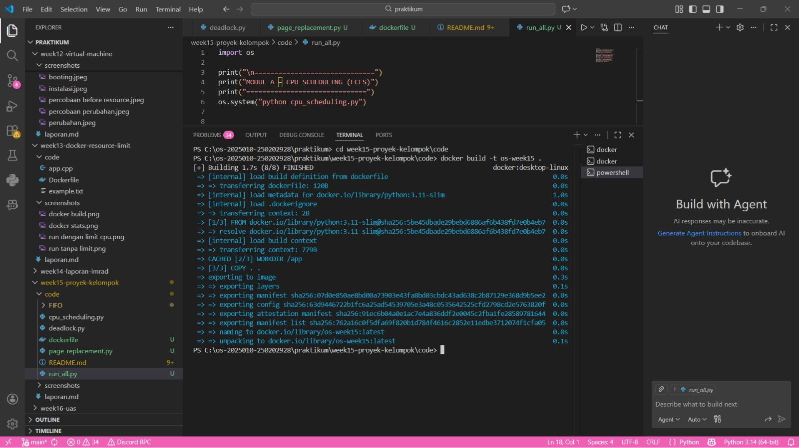
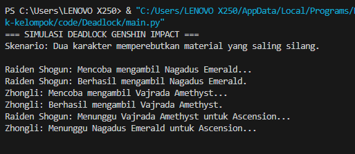

# Laporan Praktikum Minggu 15
Topik: Proyek Kelompok – Mini Simulasi Sistem Operasi (Scheduling + Memory + Container)


---

## 1. Pendahuluan

**A. Latar Belakang**

Sistem operasi berfungsi sebagai dasar utama bagi semua kegiatan komputasi saat ini, baik pada komputer maupun smartphone. Tugas pokoknya meliputi pengelolaan proses, pengaturan memori, serta pembagian sumber daya supaya aplikasi berjalan lancar dan efisien. Akan tetapi, cara kerja internalnya seperti algoritma penjadwalan CPU, metode penggantian halaman memori, dan pengendalian pada deadlock, sering kali terasa abstrak dan sulit dibayangkan tanpa contoh nyata.

Untuk mengatasi hal ini, diperlukan alat bantu belajar yang mampu menyederhanakan konsep rumit tersebut melalui situasi sehari-hari yang mudah dikenali. Pendekatan menggunakan analogi dari aktivitas digital umum, terutama bermain game, bisa menjadi cara efektif agar lebih mudah memahami prinsip kerja sistem operasi.

Oleh karena itu, kami mengembangkan ketiga modul yang meliputi:

1. **Simulasi CPU Scheduling menggunakan algoritma First-Come First-Served (FCFS)**, yang direpresentasikan melalui proses loading berbagai komponen game Genshin Impact seperti launcher, pembaruan, dan inisialisasi aset. Simulasi ini menggambarkan bagaimana CPU memprioritaskan eksekusi proses berdasarkan urutan kedatangan.

2. **Simulasi Page Replacement dengan pendekatan FIFO (First-In First-Out)**, yang divisualisasikan melalui mekanisme pemuatan aset game ke dalam RAM ponsel dan menjelaskan bagaimana sistem operasi mengelola keterbatasan memori dengan mengganti data yang paling lama dimuat ketika kapasitas penuh.
   
3. **Simulasi Deadlock Detection**, yang mengilustrasikan kondisi deadlock melalui skenario perebutan material ascension karakter dalam Genshin Impact. Dua proses (karakter) saling menunggu resource yang dipegang oleh proses lainnya, menciptakan kondisi deadlock yang dapat diidentifikasi dan dianalisis.

**B. Tujuan Proyek**

1. Memahami konsep inti sistem operasi secara aplikatif
2. Menyederhanakan konsep sistem operasi melalui pendekatan analogi pada game
3. Mengintergrasikan beberapa modul sistem operasi dalam satu aplikasi terpadu
4. Melatih kemampuan kerja kolaboratif dalam pengembangan perangkat lunak
5. Menerapkan praktik pengelolaan proyek berbasis git secara baik
6. Mengembangkan penyusunan dokumentasi proyek yang sistematis


---

## 2. Arsitektur aplikasi

**A. Gambaran Arsitektur Aplikasi**

Aplikasi ini dirancang sebagai aplikasi berbasis terminal (CLI) yang terdiri dari beberapa modul simulasi sistem operasi yang berdiri secara modular dan independen.
Setiap modul merepresentasikan satu konsep utama sistem operasi dan dapat dijalankan secara terpisah, namun tetap berada dalam satu konteks aplikasi pembelajaran terpadu.

Secara umum, arsitektur aplikasi terdiri dari:

1. **Input**: dataset statis
2. **Prosseing Modul**: simulasi algoritma sistem operasi
3. **Output**: tabel ASCII dan ringkasan metrik hasil simulasi

---

**B. Modul dan Alur Data**


**Modul A – CPU Scheduling (FCFS)**

Modul CPU Scheduling mengimplementasikan algoritma First-Come First-Served (FCFS) untuk mensimulasikan proses masuk ke dalam game Genshin Impact.


1. Dataset proses direpresentasikan dalam bentuk list berisi:

 - Nama proses (contoh: Launcher, LoadAssets)
 - Arrival Time (AT)
 - Burst Time (BT)

2. Data proses diurutkan berdasarkan arrival time untuk memenuhi prinsip FCFS.

3. Modul menghitung:
   
- Start Time (ST)
- Finish Time (FT)
- Waiting Time (WT)
- Turnaround Time (TAT)

4. Hasil simulasi ditampilkan dalam bentuk tabel ASCII beserta rata-rata WT dan TAT.

Peran Modul:

Menggambarkan bagaimana CPU mengeksekusi proses berdasarkan urutan kedatangan tanpa preemption, dianalogikan sebagai tahapan loading saat pemain masuk ke dunia game.

--- 

**Modul B – Page Replacement (FIFO)**

Modul Page Replacement mengimplementasikan algoritma First-In First-Out (FIFO) untuk mensimulasikan pengelolaan RAM pada perangkat saat game berjalan.

Struktur dan Alur Data:

1. Dataset aset game dibaca dari file CSV
   
2. Pengguna memasukkan kapasitas RAM (jumlah frame).
   
3. Modul memproses setiap aset secara berurutan:

- Jika aset belum ada di RAM = page fault (MISS)

- Jika aset sudah ada = page hit (HIT)

4. Jika RAM penuh, aset paling lama dimuat akan dikeluarkan (FIFO)
   
5. Output ditampilkan per langkah berupa:

- Isi RAM

- Status HIT/MISS

6. Di akhir simulasi, modul menghitung total page fault dan hit ratio.
 
Peran Modul:

Menunjukkan bagaimana sistem operasi mengelola keterbatasan memori dengan mengganti data lama saat kapasitas penuh, dianalogikan sebagai pemuatan aset game di RAM HP.

---


**Modul C – Deadlock Simulation**

1. Dua resource direpresentasikan sebagai objek Lock:
   
- Resource A (Nagadus Emerald)

- Resource B (Vajrada Amethyst)
  
2. Dua thread (proses) dijalankan secara paralel:

- Proses Raiden Shogun

- Proses Zhongli
  
3. Masing-masing proses:

- Mengunci satu resource terlebih dahulu

- Menunggu resource lain yang sedang dipegang proses lain

4. Kondisi ini menyebabkan circular wait dan deadlock.
   
5. Program berhenti tanpa menyelesaikan seluruh proses, menandakan deadlock terjadi.

Peran Modul:

Modul ini mengilustrasikan konsep deadlock secara nyata, di mana dua proses saling menunggu resource, sesuai dengan teori deadlock pada sistem operasi.

---

## 3. Pengujian Demo

Menjalankan docker dengan

```bash
docker build -t os-week15 .
docker run --rm week15-os
```

**Docker Build**




**Simulasi Demo 1 – CPU Scheduling (FCFS)**

Proses masuk ke game Genshin Impact

**Sumber Data**: Dataset internal aplikasi

**Deskripsi**: Simulasi penjadwalan CPU menggunakan algoritma FCFS berdasarkan urutan kedatangan proses.

**Parameter yang Diamati**:

1. Urutan eksekusi proses
2. Waiting Time setiap proses
3. Turnaround Time setiap proses
4. Nilai rata-rata WT dan TAT

---

**Simulasi Demo 2 – Manajemen Memori (FIFO)**

Pengelolaan RAM HP saat game berjalan

**Sumber Data**: File aset (1asset.csv)

**Parameter**: Kapasitas memori ditentukan oleh pengguna 

**Parameter yang Diamati**:

1. Page fault
2. Aset yang digantikan dari memori
3.Hit ratio sistem

---

**Simulasi Demo 3 – Simulasi Deadlock**

Perebutan material ascension karakter

**Sumber Data**: Dataset internal aplikasi

---

## 4. Hasil pengujian dan analisis

**1. Simulasi CPU Scheduling – FCFS (First Come First Served)**


**Data uji**

Simulasi ini menggambarkan proses masuk game Genshin Impact dengan beberapa tahapan proses berikut:

| Proses      | Arrival Time (AT) | Burst Time (BT) |
| ----------- | ----------------: | --------------: |
| Launcher    |                 0 |               5 |
| CheckUpdate |                 1 |               8 |
| LoadAssets  |                 2 |              12 |
| InitAudio   |                 3 |               4 |
| EnterWorld  |                 4 |              10 |

Tabel Output FCFS

| Proses      | AT | BT | ST | FT | WT | TAT |
| ----------- | -- | -- | -- | -- | -- | --- |
| Launcher    | 0  | 5  | 0  | 5  | 0  | 5   |
| CheckUpdate | 1  | 8  | 5  | 13 | 4  | 12  |
| LoadAssets  | 2  | 12 | 13 | 25 | 11 | 23  |
| InitAudio   | 3  | 4  | 25 | 29 | 22 | 26  |
| EnterWorld  | 4  | 10 | 29 | 39 | 25 | 35  |

**Hasil**
**Rata-rata Waiting Time (WT)**: 12,40 detik

**Rata-rata Turnaround Time (TAT)**: 20,20 detik

**Analisis**

Algoritma FCFS mengeksekusi proses berdasarkan urutan kedatangan tanpa mempertimbangkan durasi proses. Terlihat bahwa proses LoadAssets dengan burst time besar menyebabkan proses berikutnya (InitAudio dan EnterWorld) harus menunggu cukup lama.

Hal ini menimbulkan efek convoy effect, di mana proses pendek ikut tertahan oleh proses yang lebih panjang meskipun proses tersebut datang lebih awal.

---

**2. Simulasi Page Replacement – FIFO (Monitoring RAM HP)**


**Data uji** :

**Sumber Data**: 1asset.csv

**Urutan Aset**:
Mondstadt → Liyue → RaidenShogun → Mondstadt → Inazuma → Liyue → Sumeru → RaidenShogun

**Kapasitas RAM**: 3 Frame

| Step | Aset Genshin | Isi RAM HP                         | Status |
| ---: | ------------ | ---------------------------------- | ------ |
|    1 | Mondstadt    | [Mondstadt]                        | MISS   |
|    2 | Liyue        | [Mondstadt | Liyue]                | MISS   |
|    3 | RaidenShogun | [Mondstadt | Liyue | RaidenShogun] | MISS   |
|    4 | Mondstadt    | [Mondstadt | Liyue | RaidenShogun] | HIT    |
|    5 | Inazuma      | [Liyue | RaidenShogun | Inazuma]   | MISS   |
|    6 | Liyue        | [Liyue | RaidenShogun | Inazuma]   | HIT    |
|    7 | Sumeru       | [RaidenShogun | Inazuma | Sumeru]  | MISS   |
|    8 | RaidenShogun | [RaidenShogun | Inazuma | Sumeru]  | HIT    |

**Hasil** :

**Total Page Fault**: 5 kali

**Hit Ratio**: 37,5%

**Analisis**

FIFO mengganti aset berdasarkan urutan masuk pertama ke memori. Aset Mondstadt terhapus saat RAM penuh meskipun masih sering diakses. Hal ini menunjukkan bahwa FIFO tidak memperhatikan pola penggunaan aset.

---

**3. Simulasi Deadlock – Perebutan Resource**



Simulasi menggambarkan dua karakter (Raiden Shogun dan Zhongli) yang saling memperebutkan dua resource:

     Resource A: Nagadus Emerald
     Resource B: Vajrada Amethyst
    

| Proses        | Resource Diambil | Status   |
| ------------- | ---------------- | -------- |
| Raiden Shogun | Resource A       | Berhasil |
| Zhongli       | Resource B       | Berhasil |
| Raiden Shogun | Resource B       | Menunggu |
| Zhongli       | Resource A       | Menunggu |

**Analisis**
Kondisi deadlock terjadi karena keempat syarat deadlock terpenuhi:

1. **Mutual Exclusion** – Resource tidak dapat digunakan bersama.

2. **Hold and Wait** – Proses memegang satu resource sambil menunggu resource lain.

3. **No Preemption** – Resource tidak dapat direbut paksa.

4. **Circular Wait** – Terjadi siklus saling menunggu.

Akibatnya, kedua thread tidak dapat melanjutkan eksekusi dan program berhenti tanpa menyelesaikan proses.

---

## 5. Pembagian Peran dan Kontribusi

| No | Nama Anggota                | Peran                     | Tanggung Jawab Utama                                                                                                                                                                                                                     |
| -- | --------------------------- | ------------------------- | ---------------------------------------------------------------------------------------------------------------------------------------------------------------------------------------------------------------------------------------- |
| 1  | Alya Deviana Putri Reynaldi | Project Lead / Integrator | Mengkoordinasikan kerja tim, mengatur pembagian tugas, mengintegrasikan seluruh modul, melakukan merge pull request, memastikan build dan Docker berjalan dengan baik. |
| 2  | Nisa'ul Hidayah             | Developer 1               | Mengimplementasikan modul CPU Scheduling (FCFS) dan melakukan pengujian fungsional modul.                                                                                                                                            |
| 3  | Latifah Risti Anggraeni     | Developer 2               | Mengimplementasikan modul Page Replacement (FIFO) dan Deadlock Detection, serta memastikan integrasi antar modul berjalan dengan benar.                                                                                          |
| 4  | Muslimah Nuraini            | Dokumentasi & QA          | Melakukan pengujian menggunakan dataset, menyusun dan merapikan README.md, serta menyiapkan dokumentasi dan screenshot hasil eksekusi aplikasi.    


---

## 6. Quiz

**1. Tantangan terbesar integrasi modul apa, dan bagaimana solusinya?**

**Tantangan**

Tantangan utama dalam integrasi modul adalah menyatukan tiga simulasi yang berbeda karakteristiknya ke dalam satu aplikasi yang konsisten dan mudah dijalankan.

Setiap modul memiliki:

1. Pola input berbeda (hardcoded list pada FCFS, file CSV pada FIFO, dan threading pada deadlock),
2. Alur eksekusi berbeda (sekali jalan vs interaksi pengguna),
3. Format output berbeda (tabel perhitungan, log status, dan output proses paralel).

Perbedaan ini berpotensi menyebabkan kebingungan pengguna serta kesulitan saat integrasi dan pengujian.

**Solusi**

1. Membuat menu CLI utama sebagai entry point untuk memilih modul simulasi.
2. Menyamakan gaya output tabel dan penamaan metrik agar konsisten antar modul.
3. Memisahkan setiap modul ke dalam file atau fungsi terpisah, sehingga integrasi hanya dilakukan pada level pemanggilan modul, bukan logika internalnya.
4. Menambahkan dokumentasi penggunaan di README untuk menjelaskan alur eksekusi masing-masing modul.

**2. Mengapa Docker membantu proses demo dan penilaian proyek?**

- Konsistensi lingkungan di semua komputer
- Mudah deploy dan menjalankan aplikasi
- Hasil reproducible
- Isolasi dari sistem host
- Portabilitas tinggi
- Standarisasi penilaian untuk semua kelompok

**3. Jika dataset diperbesar 10x, modul mana yang paling terdampak performanya? Jelaskan.**

Jika ukuran dataset diperbesar hingga 10 kali lipat, dampak performa paling signifikan terjadi pada Modul Page Replacement (FIFO).

| Modul                  | Dampak Performa      | Penjelasan                                                                                                                                                 |
| ---------------------- | -------------------- | ---------------------------------------------------------------------------------------------------------------------------------------------------------- |
| **FCFS**               | Sedang        | Kompleksitas waktu bersifat linear (O(n)). Penambahan jumlah proses hanya memperpanjang waktu simulasi tanpa meningkatkan kompleksitas perhitungan.        |
| **FIFO**               | Paling terdampak | Setiap page/asset harus dicek keberadaannya di memori. Semakin banyak data dan frame, semakin sering operasi pencarian dan penggantian halaman dilakukan.  |
| **Deadlock Detection** | Rendah               | Jumlah thread dan resource tetap kecil. Dataset yang lebih besar tidak secara langsung memengaruhi performa kecuali jumlah proses/resource ikut bertambah. |

Modul FIFO paling sensitif terhadap peningkatan ukuran dataset karena sangat bergantung pada jumlah referensi memori yang diproses secara berulang. Hal ini mencerminkan kondisi nyata pada sistem operasi, di mana manajemen memori menjadi bottleneck (kemacetan) ketika beban aplikasi meningkat.


---


