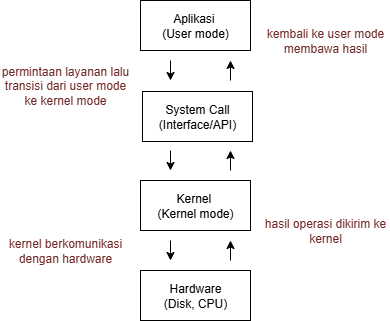
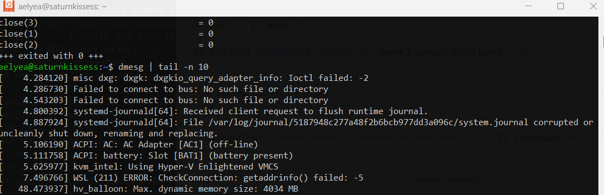

# Laporan Praktikum Minggu 2
Topik: Mekanisme System Call dan Struktur Sistem Operasi.

---

## Identitas
- **Nama**  : Alya Deviana Putri Reynaldi 
- **NIM**   : 250202928	
- **Kelas** : 1IKRB

---

## Tujuan
- Memahami konsep dan struktur alur mekanisme dari system call.
- Mengamati proses komunikasi dari aplikasi (user space) ke kernel melalui system call.
- Mengklasifikasikan berbagai jenis sytem call.
- Meningkatkan kemampuan teknis dalam lingkungan linux.

---

## Dasar Teori

Analisis System Call dengan `strace`

`strace` adalah alat diagnostik di Linux yang digunakan untuk melacak semua system call yang dilakukan oleh suatu program.

Pemantauan Aktivitas Kernel dengan `dmesg`

Perintah `dmesg` menampilkan pesan log dari kernel, terutama yang berkaitan dengan perangkat keras, driver, dan aktivitas sistem dan bisa membedakan aktivitas internal kernel dari output biasa program di user space.

Proses Komunikasi User Space ke Kernel Space

Ketika aplikasi menjalankan perintah seperti `ls` atau `cat`, program tidak langsung mengakses perangkat keras tetapi memanggil system call yang kemudian diteruskan ke kernel.

Manajemen File I/O melalui System Call

Operasi dasar seperti `open()`, `read()`, `write()`, dan `close()` digunakan untuk mengakses file agar proses I/O dilakukan secara aman, efisien, dan terkontrol.

---

## Langkah Praktikum
1. Menyiapkan lingkungan Linux (Ubuntu/WSL) dan memastikan paket `strace`, `man`, serta `git` sudah terinstal dengan benar.

2. Membuka terminal dan menjalankan perintah `strace ls` untuk mengamati daftar system call yang digunakan oleh perintah `ls`.

3. Mencatat dan menganalisis 5–10 system call pertama yang muncul, kemudian menyimpannya dalam file `results/syscall_ls.txt`.

4. Melakukan pengamatan terhadap system call pada operasi file I/O menggunakan perintah `strace -e trace=open,read,write,close cat /etc/passwd`.

5. Mengidentifikasi urutan eksekusi system call `open`, `read`, `write`, dan `close` yang terjadi selama proses pembacaan file.

6. Menjalankan perintah `dmesg | tail -n 10` untuk mengamati aktivitas kernel dan membedakan log kernel dengan output program biasa.

7. Membuat diagram alur system call yang menggambarkan perpindahan dari mode user ke mode kernel dan kembali lagi.

8. Menyimpan diagram hasil observasi ke dalam folder `screenshots/syscall-diagram.png`.

9. Mengumpulkan seluruh hasil percobaan (file, diagram, dan analisis) ke dalam folder `praktikum/week2-syscall-structure/`.

10. Melakukan commit dan push hasil akhir ke repositori GitHub dengan pesan:
  ```bash
   git add .
   git commit -m "Minggu 2 - Struktur System Call dan Kernel Interaction"
   git push origin main
   ```
---

## Kode / Perintah

```bash
strace ls
strace -e trace=open,read,write,close cat /etc/passwd
dmesg | tail -n 10
```

---

## Hasil Eksekusi
Diagram:




---

## Analisis

---

# Tabel Observasi

Analisis dari `strace ls`


| No | Nama System Call | Kegunaan | Penjelasan |
|----|------------------|-----------------------------|-------------------------------|
| 1  | execve()         | Menjalankan program `ls`. | Pertama kali dipanggil untuk mengeksekusi perintah. |
| 2  | brk()            | Mengatur batas segmen memori proses. | Digunakan untuk alokasi memori dinamis. |
| 3  | access()         | Mengecek izin akses terhadap file atau direktori. | Memastikan direktori dapat dibaca oleh pengguna. |
| 4  | openat()         | Membuka file atau direktori. | Membuka direktori kerja untuk membaca isi folder. |
| 5  | fstat()          | Mengambil informasi status file. | Mengecek metadata file seperti ukuran dan izin. |
| 6  | getdents64()     | Membaca entri direktori. | Mengambil daftar isi folder tempat `ls` dijalankan. |
| 7  | read()           | Membaca isi file atau direktori. | Mengambil data dari sistem file. |
| 8  | write()          | Menulis ke output standar. | Menampilkan hasil `ls` ke layar terminal. |
| 9  | close()          | Menutup file yang dibuka. | Menyelesaikan akses ke file atau direktori. |
| 10 | exit_group()     | Mengakhiri proses utama. | Proses `ls` selesai dan dikembalikan ke shell. |

Analisis dari `strace -e trace=open,read,write,close cat /etc/passwd`


| No | System Call | Kegunaan | Penjelasan |
|----|--------------|-----------------------------|-------------------------------|
| 1  | open()       | Membuka file `/etc/passwd`. | File berhasil dibuka untuk dibaca. |
| 2  | read()       | Membaca isi file. | Kernel mengirim isi file ke buffer proses. |
| 3  | write()      | Menulis ke output standar. | Isi file ditampilkan di terminal. |
| 4  | close()      | Menutup file setelah dibaca. | Descriptor file dilepaskan. |

Pada percobaan `strace -e trace=open,read,write,close cat /etc/passwd`, kernel berperan sebagai perantara utama dalam proses akses file. Program `cat` terlebih dahulu memanggil system call `open()` untuk membuka file dan mendapatkan izin akses, kemudian `read()` digunakan untuk membaca isi file dari disk dan menyalinnya ke memori. Data yang telah dibaca kemudian dikirim ke terminal melalui `write()`, dan setelah seluruh isi file berhasil ditampilkan, kernel menutup file dengan `close()` guna melepaskan sumber daya yang digunakan.

Analisis dari `dmesg | tail -n 10`



| No | Output Log Kernel | Penjelasan |
|----|--------------------|---------------------------|
| 1  | [1234.567890] usb 1-2: new device found | Kernel mendeteksi perangkat USB baru. |
| 2  | [1234.568001] systemd[1]: Starting user session... | Kernel menginisialisasi sesi pengguna. |
| 3  | [1234.568900] audit: type=1107 ... | Pesan audit keamanan dari kernel. |
| 4  | [1234.569800] systemd-logind[702]: New session of user. | Kernel mencatat login baru. |
| 5  | [1234.571000] audit: user pid=1000 comm="bash" | Kernel mencatat aktivitas proses bash. |

Program biasa seperti `ls` atau `cat` hanya menampilkan hasil operasi pada level user. Jadi, `dmesg` menunjukkan aktivitas yang terjadi di dalam kernel space, sedangkan program biasa hanya berinteraksi melalui system call tanpa akses langsung ke kernel.


---

**Pentingnya System Call untuk Keamanan Sistem Operasi.**

System call adalah mekanisme yang digunakan oleh program atau aplikasi untuk berkomunikasi dengan sistem operasi secara aman dan terkontrol, khususnya dengan kernel. System call sangat penting untuk keamanan karena membantu sistem menjaga agar tidak mudah diretas maupun rusak. Berikut ini adalah penjelasan tentang pentingnya system call untuk keamanan sistem operasi:

1.	Pengendalian Akses (Access Control)
   
Melalui system call, setiap permintaan dari program pengguna harus melewati kernel terlebih dahulu lalu memeriksa hak akses dan izin dari proses sebelum mengizinkan tindakan dilakukan. Oleh karena itu, sistem bisa mencegah penyalahgunaan program yang tidak berwenang untuk membaca file milik pengguna lain ataupun melakukan operasi berbahaya yang bisa merusak sistem.

2.	Skalabilitas dan Pembaruan Keamanan
   
System call mendukung skalabilitas sistem operasi, yaitu kemampuan sistem untuk menangani peningkatan beban kerja atau jumlah pengguna tanpa menurunkan kinerja, sehingga sistem dapat menjalankan banyak prose secara bersamaan dengan stabil dan kernel dapat mengatur sumber daya seperti CPU, memori, dan perangkat I/O secara fleksibel. Untuk pembaruan sistem, system call juga mempermudah pembaruan dan perbaikan dengan fitur keamanan baru serta memperkuat celah keamanan melalui penampahan lapisan keamanan ektra tanpa mengubah seluruh sistem.

3.	Efisiensi dan Kesederhanaan
   
System call membuat sistem operasi menjadi lebih efisien dan sederhana dalam menjalankan fungsi keamanannya dikarenakan semuanya sudah diatur secara terpusat oleh kernel. Hal ini membuat penggunaan sumber daya seperti memori dan CPU menjadi lebih optimal serta mengurangi potensi kesalahan atau konflik antarproses. Selain itu, dengan adanya antarmuka standar antara aplikasi dan kernel, sistem menjadi lebih sederhana untuk dikelola dan diperbarui.

**Cara Sistem Operasi Memastikan Transisi User ke Kernel Berjalan Aman**

Sistem operasi dirancang untuk membuat transisi ini terkendali dan terlindungi melalui beberapa mekanisme utama, diantaranya yaitu:

1.	Penggunaan Hardware untuk Switch Mode
   
CPU memiliki fitur bawaan seperti "privilege rings” yang memisahkan level akses dan pemeriksaan otomatis jika ada kesalahan. Saat system call dipanggil, program user menggunakan instruksi khusus seperti "syscall" atau "int" (interrupt) untuk memicu transisi, seperti saat transisi, CPU menonaktifkan interupsi lain untuk mencegah gangguan, sehingga hanya kernel yang bisa mengontrol alur.

2.	Validasi oleh Kernel
   
Setelah dilakukannya transisi, kernel memeriksa permintaan system call untuk memastikan keamanan melalui pengecekan parameter valid dan penggunaan sistem pemantauan yang menggunakan fitur seperti “system call table”

3.	Perlindunngan dari Ancaman Eksternal
   
Sistem Operasi menerapkan lapisan keamanan tambahan, seperti sandboxing dan isolasi untuk membatasi system call yang bisa digunakan oleh program user serta error handling, yang berguna mencegah deadlock atau serangan yang memanfaatkan kegagalan.

**Contoh System Call yang Sering Digunakan di Linux.**

•	**File dan I/O Operations**:

>	open()
   
Digunakan untuk membuka file atau device.

>	read()
   
Digunakan untuk membaca data dari file.

>	write()
   
Digunakan untuk menulis data ke file.

> close()

Digunakan untuk menutup file descriptor.

•	**Process Management**

>	fork()
	
Digunakan untuk membuat salinan proses baru.

>	execve()

Digunakan untuk menjalankan executable baru.

>	exit()
	
Digunakan untuk menghentikan proses.

>	waitpid()
    
Digunakan untuk menunggu proses child selesai.

•	**Memory and System Information**

>	mmap()

Digunakan untuk memetakan file ke memori.

>	getpid()

Digunakan untuk mendapatkan ID proses.

•	**Network and Signal Handling**

>	socket()

Digunakan untuk membuat socket untuk jaringan.
>	kill()

Digunakan untuk mengirim sinyal ke proses.


---

## Quiz
1. Apa fungsi utama system call dalam sistem operasi

    **Jawaban:**

**Penghubung antara aplikasi dan kernel**

System call menjadi antarmuka resmi agar program bisa berinteraksi dengan sumber daya sistem tanpa perlu mengaksesnya langsung.

**Pengelolaan sumber daya (Resource Management)**

 System call memungkinkan aplikasi untuk menggunakan CPU, memori, dan perangkat I/O secara efisien dengan pengaturan dari kernel.

**Keamanan dan kontrol akses**

 Melalui system call, kernel memeriksa izin setiap operasi agar program tidak bisa mengakses data atau perangkat tanpa otorisasi.

**Komunikasi antara proses (Interprocess Communication)**

System call menyediakan mekanisme agar proses dapat saling bertukar data atau pesan secara aman.

**Penanganan perangkat keras**

 Aplikasi tidak berinteraksi langsung dengan hardware; system call yang meneruskan permintaan ke driver perangkat.

**Menjaga stabilitas sistem**

Dengan system call, semua interaksi user dengan kernel dilakukan secara terkendali, sehingga kesalahan pada aplikasi tidak merusak keseluruhan sistem operasi.
   
2. Sebutkan 4 kategori system call yang umum digunakan. 

    **Jawaban:**

**System Call Manajemen Proses (Process Control)**

Digunakan untuk membuat, menghapus, atau mengatur proses.

Contoh: fork(), exec(), exit(), wait()

Fungsi: memungkinkan sistem menjalankan program baru, menghentikan proses, atau menunggu proses lain selesai.

**System Call Manajemen Berkas (File Management)**

Digunakan untuk mengatur operasi pada file dan direktori.

Contoh: open(), read(), write(), close(), unlink()

Fungsi: memungkinkan aplikasi untuk menyimpan, membaca, menulis, atau menghapus data pada penyimpanan.

**System Call Manajemen Perangkat (Device Management)**

Digunakan untuk mengontrol dan berkomunikasi dengan perangkat input/output.

Contoh: ioctl(), read(), write()

Fungsi: memberikan akses terkontrol agar aplikasi bisa menggunakan perangkat keras seperti keyboard, printer, atau disk.

**System Call Manajemen Informasi (Information Maintenance**

Digunakan untuk menyediakan informasi tentang sistem, proses, atau waktu.

Contoh: getpid(), alarm(), time(), getuid()

Fungsi: memberi data penting seperti ID proses, waktu sistem, atau informasi pengguna.

   
3. Mengapa system call tidak bisa dipanggil langsung oleh user program?

   **Jawaban:**

    System call tidak dapat dipanggil langsung oleh program pengguna karena alasan keamanan, stabilitas, dan desain sistem operasi. CPU membedakan level akses antara user mode (ring 3) dan kernel mode (ring 0) untuk mencegah program biasa menjalankan instruksi berprivilege tinggi yang dapat merusak sistem. Dengan mewajibkan setiap permintaan melewati kernel, sistem dapat memvalidasi parameter, memeriksa izin, dan mencegah akses tidak sah yang berpotensi menyebabkan serangan atau kebocoran data.
   
   Selain itu, mekanisme ini menjaga stabilitas dan konsistensi karena kernel menangani pengelolaan sumber daya dan penanganan kesalahan secara terpusat. System call juga berfungsi sebagai lapisan abstraksi yang memisahkan aplikasi dari detail perangkat keras, sehingga meningkatkan portabilitas dan memudahkan pembaruan keamanan tanpa mengubah aplikasi. Oleh karena itu, dipastikan bahwa setiap interaksi dengan sistem dilakukan melalui jalur yang aman, terkontrol, dan efisien.

---

## Kesimpulan

1. System call berperan sebagai jembatan aman antara program pengguna (user space) dan kernel dalam mengakses sumber daya sistem.

2. Melalui percobaan dengan `strace`, terbukti bahwa setiap operasi sederhana seperti membuka atau membaca file melibatkan serangkaian system call yang dikontrol penuh oleh kernel.

3. Mekanisme ini menjamin keamanan, stabilitas, dan efisiensi sistem operasi dengan memastikan hanya kernel yang memiliki hak akses langsung ke perangkat keras.


---

## Refleksi Diri
Tuliskan secara singkat:
- Apa bagian yang paling menantang minggu ini?  Berusaha memahami urutan system call dan membaca output dari strace dengan sangat lama karena tampilannya sangat detail.
- Bagaimana cara Anda mengatasinya?  Melihat hasil `strace` serta mencari referensi dokumentasi system call sehingga bisa memahami sedikit demi sedikit fungsi setiap panggilan secara lebih jelas.

---

**Credit:**  
_Template laporan praktikum Sistem Operasi (SO-202501) – Universitas Putra Bangsa_
