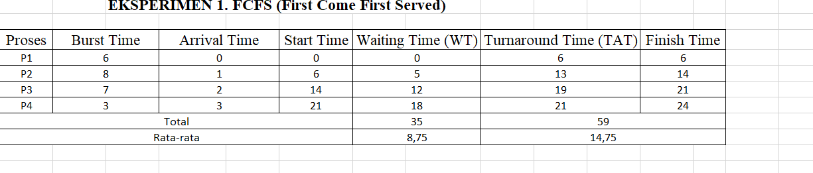
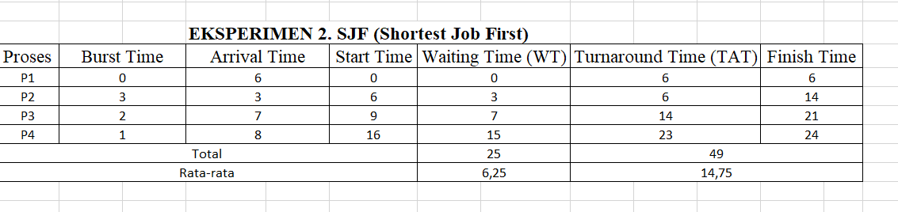

# Laporan Praktikum Minggu 5
Topik: Penjadwalan CPU – FCFS dan SJF


---

## Identitas
- **Nama**  : Alya Deviana Putri Reynaldi
- **NIM**   : 250202928
- **Kelas** : 1IKRB

---

## Tujuan
1. Memahami prinsip dasar algoritma penjadwalan CPU FCFS dan SJF dalam menentukan urutan eksekusi proses.
2. Menghitung secara manual waktu tunggu (waiting time) dan waktu penyelesaian (turnaround time) untuk setiap proses pada kedua algoritma.
3. Menganalisis perbedaan performa antara FCFS dan SJF melalui perbandingan rata-rata waktu tunggu dan turnaround time.
4. Membuat dan menginterpretasikan Gantt chart sebagai representasi visual dari simulasi penjadwalan.
5. Menerapkan simulasi penjadwalan pada skenario proses yang berbeda
---

## Dasar Teori

**1. Konsep Dasar Penjadwalan CPU**
   
Penjadwalan CPU adalah bagian dari manajemen proses yang mengatur pembagian waktu prosesor di antara sejumlah proses yang sedang menunggu eksekusi.

**2. FCFS (First Come First Served)**

Metode penjadwalan yang mengeksekusi proses berdasarkan urutan kedatangannya. Proses yang datang terlebih dahulu akan diproses lebih dulu hingga selesai tanpa adanya interupsi. Meskipun sederhana dan mudah diimplementasikan, algoritma ini memiliki kelemahan berupa waktu tunggu yang tinggi apabila terdapat proses dengan waktu eksekusi panjang, yang dikenal dengan istilah convoy effect.

**3. SJF (Shortest Job First)**

Metode penjadwalan yang memilih proses dengan waktu eksekusi (burst time) paling singkat di antara proses yang telah tiba. Pendekatan ini dapat menghasilkan waktu tunggu rata-rata yang lebih rendah dibandingkan FCFS, sehingga dianggap lebih efisien. Namun, algoritma ini memiliki kelemahan berupa kemungkinan starvation terhadap proses berdurasi panjang apabila terus muncul proses dengan durasi pendek.

**4. Parameter Evaluasi (WT dan TAT)**

Dalam mengevaluasi performa suatu algoritma penjadwalan, terdapat dua parameter utama yang digunakan, yaitu:

**Waiting Time (WT)**

Waktu yang dihabiskan proses dalam antrian sebelum dieksekusi.

**Turnaround Time (TAT)**

Total waktu sejak proses tiba hingga selesai dieksekusi.


>*Nilai rata-rata WT dan TAT*
digunakan untuk membandingkan efisiensi algoritma penjadwalan.


 
---

## Langkah Praktikum
1. Menyiapkan data proses yang berisi waktu kedatangan dan waktu eksekusi untuk digunakan pada percobaan penjadwalan.

2. Menjalankan simulasi algoritma FCFS untuk menentukan urutan proses berdasarkan waktu kedatangan.

3. Menerapkan algoritma SJF dengan mengurutkan proses sesuai waktu eksekusi terpendek.

4. Menghitung nilai Waiting Time (WT) dan Turnaround Time (TAT) pada setiap proses.

5. Membuat Gantt Chart untuk menggambarkan urutan eksekusi proses pada masing-masing algoritma.

6. Menganalisis hasil perhitungan guna membandingkan performa antara FCFS dan SJF.

7. Mendokumentasikan seluruh hasil percobaan dan mengunggah laporan ke repositori Git sesuai ketentuan praktikum.

---

## Kode / Perintah

 **Eksperimen 1 – FCFS (First Come First Served)**
 - Mengurutkan proses berdasarkan *Arrival Time* dan menghitung nilai untuk tiap proses
     ```
     Waiting Time (WT) = waktu mulai eksekusi - Arrival Time
     Turnaround Time (TAT) = WT + Burst Time
     ```
   - Hitung rata-rata Waiting Time dan Turnaround Time.  
   - Buat Gantt Chart sederhana:  
     ```
     | P1 | P2 | P3 | P4 |
     0    6    14   21   24
     ```

 **Eksperimen 2 – SJF (Shortest Job First)**
   - Mengurutkan proses berdasarkan *Burst Time* terpendek (dengan memperhatikan waktu kedatangan).  
   - Melakukan perhitungan WT dan TAT seperti langkah sebelumnya.  
   - Membandingkan hasil FCFS dan SJF dengan tabel berikut:

     | Algoritma | Avg Waiting Time | Avg Turnaround Time | Kelebihan | Kekurangan |
     |------------|------------------|----------------------|------------|-------------|
     | FCFS | ... | ... | Sederhana dan mudah diterapkan | Tidak efisien untuk proses panjang |
     | SJF | ... | ... | Optimal untuk job pendek | Menyebabkan *starvation* pada job panjang |

 **Eksperimen 3 – Visualisasi Spreadsheet**
   - Menggunakan Excel/Google Sheets untuk membuat perhitungan otomatis


---

## Analisis

**Eksperimen 1 - FCFS (First Come First Served)**



**Eksperimen 2 - SJF (Shortest Job First)**




**Gantt Chart.**


**Perbandingan Hasil FCFS & SJF**

| Algoritma | Rata-rata Waiting Time (WT) | Rata-rata Turnaround Time (TAT) | Kelebihan | Kekurangan |
|------------|-----------------------------|----------------------------------|------------|-------------|
| **FCFS (First Come First Served)** | 8,75 | 14,75 | Sederhana dan adil (berdasarkan urutan kedatangan) | Tidak efisien jika ada proses dengan burst time panjang (*convoy effect*) |
| **SJF (Shortest Job First)** | 6,25 | 12,25 | Waktu tunggu dan waktu eksekusi rata-rata lebih rendah | Proses panjang bisa *starvation* (tidak mendapat giliran lama) |

**Kondisi Keunggulan FCFS dan SJF**

Keunggulan FCFS ketika:

1. Proses memiliki waktu eksekusi yang bervariasi.

2. Tujuan utama sistem adalah efisiensi dan mempercepat waktu tunggu rata-rata.

3. Semua burst time sudah diketahui di awal (non-preemptive).

 Keunggulan SJF ketika:

1. Waktu eksekusi tiap proses hampir sama.

2. Sistem menekankan keadilan (proses dilayani sesuai urutan datang).

3. Lingkungan sederhana dan tidak membutuhkan estimasi waktu proses.


---

## Kesimpulan
SJF terbukti lebih optimal dalam menekan rata-rata waktu tunggu dan penyelesaian, karena menempatkan proses singkat di awal eksekusi, sehingga total waktu eksekusi keseluruhan menjadi lebih efisien.

Jadi, algoritma penjadwalan menyesuaikan karakteristik beban kerjanya seperti FCFS cocok untuk sistem sederhana dengan beban merata, sedangkan SJF lebih sesuai untuk lingkungan yang mengutamakan performa dan efisiensi waktu eksekusi.

---

## Quiz
1. Apa perbedaan utama antara FCFS dan SJF?
   
   **Jawaban:**

   FCFS sederhana dan adil berdasarkan waktu kedatangan, sedangkan SJF fokus pada efisiensi waktu eksekusi untuk meminimalkan waktu tunggu.
   
2. Mengapa SJF dapat menghasilkan rata-rata waktu tunggu minimum?
   
   **Jawaban:**
   
   Karena SJF memilih proses dengan waktu eksekusi terpendek terlebih dahulu. Hal ini memungkinkan proses pendek selesai lebih cepat, sehingga proses lain yang menunggu dapat dimulai lebih awal, mengurangi total waktu tunggu keseluruhan, mirip dengan pengurutan berdasarkan durasi yang meminimalkan penundaan kumulatif dibandingkan FCFS yang tidak mempertimbangkan durasi.
   
3. Apa kelemahan SJF jika diterapkan pada sistem interaktif?
   
   **Jawaban:**
   
 - Dapat menyebabkan starvation (kelaparan) untuk proses dengan waktu eksekusi panjang, karena proses pendek selalu diprioritaskan.
 -  Sulit memprediksi waktu eksekusi proses secara akurat, yang dapat mengganggu interaktivitas jika proses baru yang lebih pendek terus tiba.
 - Untuk non-preemptive SJF, juga kurang cocok untuk sistem interaktif karena tidak dapat menginterupsi proses yang sedang berjalan, sehingga respons terhadap input pengguna bisa tertunda.
 
---

## Refleksi Diri
Tuliskan secara singkat:
- Apa bagian yang paling menantang minggu ini?
  
  Masih sulit memahami dan mempelajari materi minggu ini
  
- Bagaimana cara Anda mengatasinya?  

 Mencari penjelasan tambahan dari sumber online dan membaca ulang materi

---

**Credit:**  
_Template laporan praktikum Sistem Operasi (SO-202501) – Universitas Putra Bangsa_
