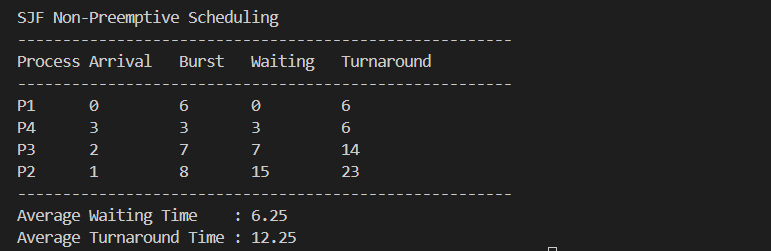

# Laporan Praktikum Minggu 9
Topik: Simulasi Algoritma Penjadwalan CPU

---

## Identitas
- **Nama**  : Alya Deviana Putri Reynaldi 
- **NIM**   : 250202928 
- **Kelas** : 1IKRB

---

## Tujuan

1. Menyiapkan dataset proses sebagai masukan simulasi.  
2. Mengembangkan aplikasi scheduling CPU berbasis command line.  
3. Menerapkan algoritma FCFS dan/atau SJF tanpa preemption.  
4. Mengeksekusi program dengan data tes.  
5. Mendokumentasikan dan menyimpan output hasil program.

---

## Dasar Teori

*Pengelolaan Eksekusi Proses dalam Sistem Operasi*

Memiliki peran penting dalam mengatur eksekusi berbagai proses yang berjalan secara bersamaan. Pengelolaan ini bertujuan agar penggunaan CPU dapat dilakukan secara efektif dengan membagi waktu pemrosesan kepada setiap proses yang berada dalam kondisi siap. Tanpa mekanisme pengaturan yang baik, proses dapat saling berebut sumber daya sehingga menurunkan kinerja sistem secara keseluruhan.

*Algoritma Penjadwalan CPU*

Algoritma penjadwalan CPU digunakan sebagai aturan untuk menentukan urutan proses yang akan dieksekusi oleh prosesor. Setiap algoritma memiliki pendekatan dan karakteristik yang berbeda dalam menentukan prioritas eksekusi proses. Pemilihan algoritma penjadwalan yang tepat dapat memengaruhi kinerja sistem, khususnya dalam hal waktu tunggu dan waktu penyelesaian proses.

*Simulasi Algoritma Penjadwalan*

Simulasi algoritma penjadwalan CPU merupakan metode untuk memodelkan cara kerja penjadwalan secara sederhana melalui program komputer. Dengan menggunakan simulasi, proses perhitungan waktu eksekusi dapat dilakukan secara otomatis dan hasilnya dapat dianalisis serta dibandingkan dengan perhitungan manual. Simulasi ini membantu dalam memahami perilaku algoritma penjadwalan secara lebih praktis dan terstruktur.

---

## Langkah Praktikum

1. Memahami prinsip scheduling CPU lewat pembuatan kode program.  
2. Membuat program simulasi untuk penjadwalan proses.  
3. Melakukan uji coba algoritma FCFS maupun SJF dengan dataset proses.  
4. Menghitung otomatis waktu tunggu dan waktu penyelesaian proses.  
5. Menampilkan output simulasi dalam format tabel dengan baik.

---

## Kode / Perintah

1. **Menyiapkan Dataset**

   | Proses | Arrival Time | Burst Time |
   |:--:|:--:|:--:|
   | P1 | 0 | 6 |
   | P2 | 1 | 8 |
   | P3 | 2 | 7 |
   | P4 | 3 | 3 |

2. **Mengimplementasi Algoritma**

   Dengan ketentuan
   
   1. Menghitung *waiting time* dan *turnaround time*.  
   2. Mendukung minimal **1 algoritma (FCFS atau SJF non-preemptive)**.  
   3. Menampilkan hasil dalam tabel.


 4. **Eksekusi & Validasi**

    Menjalankan program menggunakan dataset uji.  
  

 5. **Analisis**

    Menjelaskan alur program dan membandingkan hasil simulasi dengan perhitungan manual serta menjelaskan kelebihan dan keterbatasan simulasi.

---

## Hasil Eksekusi

---

## Analisis

**PROGRAM PENGGUNAAN DATA SET UJI : SJF Non-Preemptive**

 ```bash
import csv

def read_dataset(filename):
    processes = []
    with open(filename, 'r') as file:
        reader = csv.DictReader(file)
        for row in reader:
            processes.append({
                'process': row['Process'],
                'arrival': int(row['Arrival']),
                'burst': int(row['Burst'])
            })
    return processes


def fcfs(processes):
    time = 0
    result = []

    for p in sorted(processes, key=lambda x: x['arrival']):
        start = max(time, p['arrival'])
        waiting = start - p['arrival']
        turnaround = waiting + p['burst']
        time = start + p['burst']

        result.append({
            'process': p['process'],
            'arrival': p['arrival'],
            'burst': p['burst'],
            'waiting': waiting,
            'turnaround': turnaround
        })
    return result


def sjf_non_preemptive(processes):
    time = 0
    completed = []
    ready_queue = processes.copy()

    while ready_queue:
        available = [p for p in ready_queue if p['arrival'] <= time]

        if not available:
            time += 1
            continue

        shortest = min(available, key=lambda x: x['burst'])
        ready_queue.remove(shortest)

        waiting = time - shortest['arrival']
        turnaround = waiting + shortest['burst']
        time += shortest['burst']

        completed.append({
            'process': shortest['process'],
            'arrival': shortest['arrival'],
            'burst': shortest['burst'],
            'waiting': waiting,
            'turnaround': turnaround
        })

    return completed


def print_table(title, results):
    print(f"\n{title}")
    print("-" * 55)
    print(f"{'Process':<8}{'Arrival':<10}{'Burst':<8}{'Waiting':<10}{'Turnaround'}")
    print("-" * 55)

    for r in results:
        print(f"{r['process']:<8}{r['arrival']:<10}{r['burst']:<8}{r['waiting']:<10}{r['turnaround']}")

    avg_wait = sum(r['waiting'] for r in results) / len(results)
    avg_turn = sum(r['turnaround'] for r in results) / len(results)

    print("-" * 55)
    print(f"Average Waiting Time    : {avg_wait:.2f}")
    print(f"Average Turnaround Time : {avg_turn:.2f}")


if __name__ == "__main__":
    data = read_dataset("dataset.csv")

    fcfs_result = fcfs(data)
    sjf_result = sjf_non_preemptive(data)

    print_table("FCFS Scheduling", fcfs_result)
    print_table("SJF Non-Preemptive Scheduling", sjf_result)
 ```

Hasil:

| Process | Arrival Time | Burst Time | Waiting Time | Turnaround Time |
| ------- | ------------ | ---------- | ------------ | --------------- |
| P1      | 0            | 6          | 0            | 6               |
| P4      | 3            | 3          | 3            | 6               |
| P3      | 2            | 7          | 7            | 14              |
| P2      | 1            | 8          | 15           | 23              |


| Metric                  | Value     |
| ----------------------- | --------- |
| Average Waiting Time    | **6.25**  |
| Average Turnaround Time | **12.25** |

**ALUR PROGRAM**

Program ini mensimulasikan penjadwalan CPU dengan algoritma SJF Non-Preemptive menggunakan Python dan input CSV, dimulai dari fungsi `read_dataset` yang membaca proses (nama, arrival time, burst time) menjadi list dictionary, `sjf_non_preemptive` perulangan hingga antrian yang kosong dengan memilih proses tersedia (arrival ≤ waktu saat ini) ber-burst terpendek tanpa interupsi, memajukan waktu jika idle, menghitung metrik serupa, dan `print_table` menampilkan hasil tabel plus rata-rata waiting/turnaround serta eksekusi utama jalankan keduanya untuk perbandingan performa.


**PERBANDINGAN HASIL DARI SIMULASI DENGAN PERHITUNGAN MANUAL**

Data Proses

P1 (AT=0, BT=6)
P2 (1,8) 
P3 (2,7)
P4 (3,3)

Urutan Eksekusi Manual
P1 (0-6) 
P4 (6-9) 
P3 (9-16) 
P2 (16-24)

WT & TAT Manual

P1: WT=0, TAT=6
P4: WT=3, TAT=6
P3: WT=7, TAT=14
P2: WT=15, TAT=23

Avg WT=6.25, Avg TAT=12.25

**PERBANDINGAN HASIL**

Waiting time dan turnaround time tiap proses sesuai dengan hasil perhitungan manual.

Nilai Average Waiting Time = 6.25

Nilai Average Turnaround Time = 12.25

Hal ini menunjukkan bahwa logika algoritma yang diimplementasikan dalam program sudah benar dan sesuai dengan teori penjadwalan CPU SJF Non-Preemptive.


**KELEBIHAN DAN KETERBATASAN SIMULASI**

| No | Keterangan                                                                                                |
| -- | --------------------------------------------------------------------------------------------------------- |
| 1  | Mengotomatisasi proses perhitungan sehingga mempercepat analisis penjadwalan CPU.                         |
| 2  | Meminimalkan kesalahan manusia dalam perhitungan waiting time dan turnaround time.                        |
| 3  | Bersifat skalabel dan dapat digunakan untuk dataset yang lebih besar serta parameter proses yang beragam. |


| No | Keterangan                                                                                                         |
| -- | ------------------------------------------------------------------------------------------------------------------ |
| 1  | Simulasi hanya mendukung algoritma **SJF Non-Preemptive** dan belum mencakup algoritma penjadwalan lainnya.        |
| 2  | Tidak mempertimbangkan faktor sistem nyata seperti **I/O burst**, **prioritas proses**, dan **context switching**. |
| 3  | Belum menyediakan visualisasi **Gantt Chart** dalam bentuk grafis.                                                 |
| 4  | Tidak mendukung mekanisme **preemptive scheduling** seperti **Shortest Remaining Time First (SRTF)**.              |


---

## Kesimpulan

1. Simulasi penjadwalan CPU dengan algoritma **SJF Non-Preemptive** berhasil diimplementasikan dan menghasilkan nilai *waiting time* serta *turnaround time* yang sesuai dengan perhitungan manual.
2. Program mampu mengotomatisasi proses perhitungan dan menampilkan hasil secara terstruktur, sehingga efektif untuk analisis penjadwalan berbasis dataset.
3. Meskipun akurat, simulasi masih terbatas pada satu algoritma dan belum mencerminkan kondisi sistem nyata seperti preemptive scheduling, I/O burst, dan context switching.


---

## Quiz

1. Mengapa simulasi diperlukan untuk menguji algoritma scheduling?

   **Jawaban:**

   Karena simulasi memungkinkan evaluasi algoritma penjadwalan CPU pada skenario proses rumit yang menyerupai kondisi nyata, seperti variasi waktu kedatangan, durasi eksekusi, dan pola acak operasi sistem aktual dan dapat mengatasi masalah seperti kelaparan proses atau overhead memori cache.

   
2. Apa perbedaan hasil simulasi dengan perhitungan manual jika dataset besar?
   
   **Jawaban:**
   
   Simulasi jauh lebih praktis karena otomatis menangani kerumitan durasi proses, sedangkan manual memerlukan waktu panjang dan sulit diverifikasi untuk optimasi. Untuk data skala besar, hitungan tangan rawan kesalahan karena faktor manusia dan terhambat pada sampel terbatas, menyebabkan selisih besar dengan simulasi yang mengolah semua data secara menyeluruh.

   
3. Algoritma mana yang lebih mudah diimplementasikan? Jelaskan.
 
   **Jawaban:**

   Algoritma FCFS (First-Come-First-Served) paling sederhana untuk diimplementasikan karena hanya memproses proses berdasarkan urutan kedatangan menggunakan struktur antrian FIFO standar, tanpa memerlukan logika tambahan seperti pemilihan burst time terkecil atau pengelolaan prioritas. Berbeda dengan SJF yang harus mencari proses terpendek, Priority yang membandingkan nilai prioritas secara dinamis, atau Round Robin yang melibatkan pembagian time quantum, FCFS memerlukan kode minimal dan cocok untuk lingkungan batch processing sederhana.

   

---

## Refleksi Diri
1. Apa bagian yang paling menantang minggu ini?

   **Jawaban:**
   
   Memahami perbedaan simulasi dengan manual calculation untuk dataset besar pada algoritma scheduling karena manual mudah error.
  
2. Bagaimana cara Anda mengatasinya?  

   **Jawaban:**
   
   Belajar dari simulasi kode Python sederhana dan membandingkan hasil.


---

**Credit:**  
_Template laporan praktikum Sistem Operasi (SO-202501) – Universitas Putra Bangsa_
